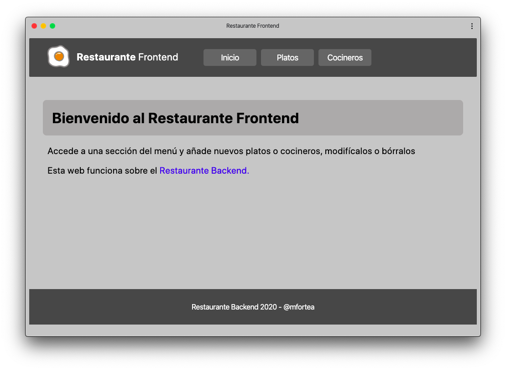
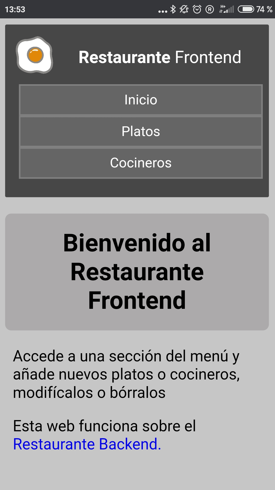

# Restaurante Frontend

Este repositorio aloja el frontend del proyecto "Restaurante Full Stack".
Este frontend se ha desarrollado utilizando el compilador/framework Svelte. Esta web es una **PWA (Aplicación web progresiva)** por lo que puede ser instalada en cualquier dispositivo cuyo navegador soporte esta tecnología.

Este frontend está alojado en la siguiente dirección: https://restaurantefrontend.now.sh/

   

